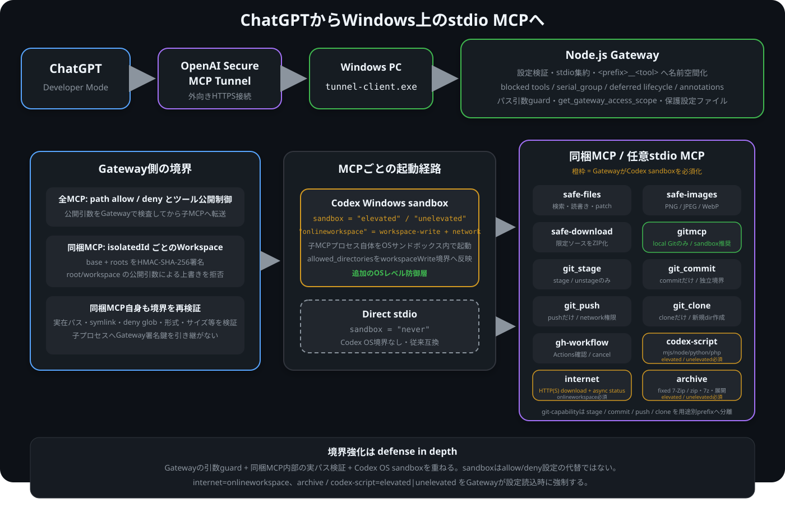

# Local MCP ChatGPT Tunnel
Windows上で動くstdio形式のMCPサーバーを、OpenAI公式Secure MCP Tunnel経由でChatGPT Developer Modeへ接続するためのローカルGatewayです。<br>
複数のstdio MCPを1つに集約し、ツール名の名前空間化、公開ツールの除外、パス許可、直列実行、遅延起動を設定ファイルから制御できます。<br>

<br>



## インストール方法

> [!IMPORTANT]
> Windows環境での導入手順は[INSTALL.md](./INSTALL.md)を参照してください。

## セキュリティ警告

> [!WARNING]
> 自分のWindows PC、自分のOpenAI Platform Organization、自分のChatGPT Workspaceだけで使う個人専用ツールです。<br>
> 任意コード実行能力を持つMCPを接続できるため、第三者への共有や公開Pluginとしての運用は想定していません。<br>

## codexサンドボックスについて

> [!IMPORTANT]
> 2026年8月11日のバージョンにおいて、codex サンドボックスを直接使用し、境界不整合や任意コード実行からパソコンを保護する仕組みが実装されました。<br>
> 一般シェルや任意実行ファイル選択は提供しませんが、固定runtimeで既存スクリプトを実行する`codex-script`が同梱されました。`codex-script`は`elevated`または`unelevated` sandboxが必須です。<br>
> そのほかの同梱MCPや外部stdio MCPもMCPごとにCodex sandbox内で起動できるため、今後は可能な範囲で`elevated`モードによる境界強化を推奨します。<br>

## AIによる実装について
> [!CAUTION]
> このリポジトリは、ChatGPT 5.6 Sol Highによって実装されました。<br>
> AIが生成したコードを含むため、誤りや脆弱性が残っている可能性があります。<br>
> 実際に使用する前にコードと設定内容を確認し、利用者自身の責任で使用してください。<br>

## 何ができるか
- ChatGPTからWindows上のstdio MCPサーバーを呼び出す
- 複数のMCPを`<prefix>__<tool>`形式のツール名へまとめる
- 任意のstdio MCPを`config/gateway.toml`へ追加する
- MCPごとに許可するディレクトリとファイルを制限する
- 危険なツールを名前または部分文字列で非公開にする
- 同時実行させたくないMCPを`serial_group`で直列化する
- 必要に応じて、特定のMCP全体を無効化する
- 必要に応じて、公開済みツールをフル識別子またはprefixで検索する内蔵ディレクトリを公開する
## このリポジトリが行わないこと
- OpenAI Responses APIやChat Completions APIの呼び出し
- 独自AIエージェント、独自ハーネス、モデル課金処理の実装
- 公開MCP URLやローカル受信ポートの提供
- Node.js、Git、ripgrep、Python、tunnel-clientの自動インストール
- Ghidra MCP、Chrome DevTools MCP、DQ9 MCPなど第三者MCPの再配布

<br>

Secure MCP Tunnelへの接続は公式`tunnel-client.exe`が担当します。<br>このリポジトリは、その標準入出力へ接続するローカルMCP Gatewayと同梱MCPを提供します。
## 対応環境
現在の導入手順はWindows 11向けです。<br>実行にはNode.js LTSとOpenAI公式`tunnel-client.exe`を使います。<br>同梱のファイル検索機能にはripgrepを使い、GitHub Actions確認にはGitHub CLIを使います。診断スクリプトは`node`、`npm`、`git`、`gh`、`rg`、`py`を確認します。
macOSとLinux向けの導入手順、Docker構成、受信ポートを開く構成は用意していません。
## 使い始めるまで
使えるようになるまでの手順は、[INSTALL.md](./INSTALL.md)にまとめています。<br>
大まかな流れは次のとおりです。<br>
1. 必要なソフトと公式`tunnel-client.exe`を手動で用意する
2. `config/gateway.example.toml`を`config/gateway.toml`へコピーして絶対パスを書き換える
3. OpenAI Platformで個人用Tunnelと実行専用runtime API keyを作る
4. Tunnel IDとruntime API keyをWindowsのユーザー環境変数へ保存する
5. `start.cmd`で診断後にTunnelを起動する
6. ChatGPT Developer Modeから個人用Tunnelを選択する<br>
設定や権限を推測して進めず、必ず[INSTALL.md](./INSTALL.md)を上から確認してください。<br>
## 同梱MCP
| MCP | 公開ツールの例 | 用途 |
| --- | --- | --- |
| `safe-files` | `list_files`、`search_text`、`file_info`、`read_text`、`write_text_file`、`replace_text`、`copy`、`move`、`apply_patch` | 許可したWorkspace内の一覧、UTF-8検索、複数ファイル・行範囲読み取り、ファイル情報、読み書き、Workspace間のファイル移動・複製、限定されたパッチ適用 |
| `safe-images` | `read_image` | PNG、JPEG、WebPをChatGPTの画像コンテンツとして読み取る |
| `safe-download` | `download_zip` | 許可したソースを単一ファイルでもZIPとしてChatGPTへ渡す |
| `gitmcp` | `get_policy`、`branches`、`create_branch`、`checkout`、`list_worktrees`、`create_worktree`、`remove_worktree`、`status`、`diff`、`stage_paths`、`unstage_paths` | 許可したリポジトリに対するローカルGit操作。commit / push / pull / cloneは含めない |
| `git-capability` | `commit`、`push`、`pull`、`clone_repository`のいずれか1つ + Workspace制御 | `--mode=`ごとに1 Git capabilityだけを独立MCPプロセスとして公開し、sandbox境界・署名・network権限を分離する |
| `gh-workflow` | `list_runs`、`watch_run`、`cancel_run`、`view_run`、`view_run_jobs`、`view_failed_logs`、`list_workflows`、`view_workflow_yaml` | 明示的に許可したGitHubリポジトリのActions実行状況確認とrunキャンセル |
| `codex-script` | `roots`、`get_working_directory`、`set_working_directory`、`run_script`または`check_file` | MCP起動時に固定したmjs / Node.js / Python / PHP runtimeで、許可Workspace内の既存スクリプト実行または構文チェック。`sandbox = "elevated"`または`"unelevated"`が必須 |
| `internet` | `download_file` | `onlineworkspace`境界内でHTTP/HTTPSから1ファイルを取得 |
| `archive` | `extract_archive`、`create_zip`、`create_7z` | 固定7-Zipだけを使うarchive作成・展開 |
| `codespace` | `list_codespaces`、`roots`、`git_root`、`search_text`、`ssh`、`copy_to_codespace`、`stop_codespace`、`list_temporary_public_deployments`、`open_temporary_public_deployment`、`close_temporary_public_deployment` | 既存GitHub Codespaceだけを対象に、remote検索・SSH・転送・停止・一時的なpublic deploymentを扱う。localhostやローカル待受ポートの自動検出は行わず、Codespace作成ツールも持たない |

<br>

同梱MCPは外部npm依存を持ちません。すべてのツールが`outputSchema`を宣言します。<br>
Gatewayは`isolated__create`、`isolated__list`、`isolated__close`を公開し、同梱MCPの全ツールへ一意な`isolatedId`を必須化します。`isolated__create`は1件以上の絶対ディレクトリを`workspaces`配列で受け取るほか、そのAI/sessionが何の作業に使う分離なのかを説明する`purpose`も必須です。Gatewayは`createdAt`を自動記録し、`isolated__list`では各prefixの`lastOperationAt`も返します。IDごとに複数WorkspaceとMCP別の相対パス基準を保持します。同梱MCPプロセス自体は複製せず、呼び出しごとに対象IDのroot群を渡します。通常のbundled tool callはGatewayで不要な直列化をせず子MCP側へ並行処理を任せ、Codespaceだけは同一`codespaceId`の競合防止用queueを持ちます。<br>
Gatewayは起動時に同梱MCPごとのランダム鍵を生成し、`isolatedId`、正規化済みの基準パス、root群をHMAC-SHA-256で署名して非公開引数として渡します。同梱MCPは未署名、改ざん済み、構造不正なコンテキストを拒否し、公開引数からの`root`、`roots`、`workspace`、`workspaces`上書きも拒否します。<br>
Gatewayは起動したすべての子MCPへ`<prefix>__get_gateway_access_scope`を追加します。同梱MCPでは`isolatedId`を付けて呼び出し、そのIDに適用される基準ディレクトリ、root群、設定値、正規化済みの許可・拒否パスを確認できます。<br>
許可範囲外のパスが拒否された場合、エラー本文へ現在許可されているディレクトリとファイルを正規化済みの絶対パスで返します。同梱MCPの共通出力形式では`structuredContent.result.accessScope`にも同じ一覧を返します。拒否後にAIが別の作業ディレクトリを推測して再試行する必要はありません。<br>
### safe-files
`safe-files`で外向きに「MCP root」と呼ぶものは、対象`isolatedId`に保存された現在の基準ディレクトリです。相対パスはこの基準から解決され、`set_working_directory`は同じIDのroot群内でのみ基準を変更します。別IDや共有MCPプロセスの状態は変更しません。<br>
`read_text`はMCP rootからの相対パスと絶対パスの両方を受け付けますが、正規化後および実在パス解決後の対象が設定された許可ディレクトリ内に残る場合だけ読み取ります。<br>
主な機能は次のとおりです。<br>
- 固定された`rg --files --hidden`による再帰一覧
- 固定された`rg`によるUTF-8テキスト検索
- UTF-8テキストの読み書きと完全一致置換
- サイズを制限したbase64ファイル転送
- ディレクトリ作成
- 設定された許可Workspace間での通常ファイルの複製と移動
- 内蔵パーサーまたは固定された`git apply`によるパッチ適用<br>
`copy`と`move`は、現在のMCP rootからの相対パスと絶対パスを受け付け、複数の`allowed_directories`間でも通常ファイルを転送できます。送信元と送信先の両方へ許可・拒否ポリシーを適用し、シンボリックリンク、ディレクトリ、既存送信先への上書きを拒否します。移動は別ドライブ間でも動作するよう、排他的な複製に成功してから送信元を削除し、削除失敗時は送信先を戻します。パス文字列はシェルへ渡さず、記号を命令として解釈しません。<br>再帰一覧では`.git`内部を常に除外し、パッチでは`.git`内部を対象にできません。許可ルート外、シンボリックリンクによる脱出、高確度で資格情報らしい内容なども拒否します。<br>一般シェル、PowerShell、任意コマンド実行ツールは含みません。
### safe-images
`safe-images`は読み取り専用です。PNG、JPEG、WebPの拡張子とマジックバイトを照合し、初期状態では8 MiB、50メガピクセルまでに制限します。<br>
SVG、HEIC、空ファイル、許可ルート外、シンボリックリンク、UNCパス、NTFS代替データストリームを拒否します。<br>
### safe-download
`safe-download`は読み取り専用で、単一ファイルまたはディレクトリを常にZIPとして返します。`safe-files`とは別の`cwd`と許可リストを設定し、ChatGPTへ渡してよいソースだけを公開します。<br>
ディレクトリは固定された`rg --files --hidden`で列挙し、`.git`内部、ROM、Save、State、秘密鍵形式、資格情報らしい内容、許可範囲外、シンボリックリンクを拒否します。`disallowed_path_globs`が設定されている場合は、利用者指定の`globs`や`excludePaths`を適用する前に対象ディレクトリ全体を確認し、拒否パターンへ一致するファイルまたはフォルダが1件でもあればZIP作成全体を拒否します。エラーには一致した設定パターンと対象パスを含めます。<br>
### internet
`internet`は任意のHTTP/HTTPS URLから1ファイルを取得する同梱MCPです。公開ツールは`download_file`だけで、送信先はGateway署名済み`isolatedId`のworkspace内に限定されます。既存ファイルの上書き、UNC/ADS、workspace外への書き込み、任意header・cookie・credential注入は受け付けません。途中失敗時は一時ファイルを削除します。<br>
このMCPは必ず`sandbox = "onlineworkspace"`で起動します。`onlineworkspace`はCodexのworkspace-write filesystem境界を維持したまま、そのpermission profileのnetworkだけを有効にします。`sandbox = "never"`へフォールバックしません。<br>
### archive
`archive`は起動時に`--seven-zip-executable=<absolute-7z.exe-path>`で7-Zipを固定し、`create_zip`、`create_7z`、`extract_archive`だけを公開する同梱MCPです。一般シェル、任意実行ファイル、任意7-Zip引数は公開しません。入力・出力は署名済みworkspace内に限定します。`extract_archive`はsourceとdestinationが別々の許可rootにあっても扱えるため、たとえばDownloads内のarchiveをProject workspaceへ直接展開できます。展開先は存在しない場合に作成し、既存の場合は空の通常ディレクトリだけを受け付けます。パスは解決後も1024文字以内に制限します。<br>
`archive`自体もCodex sandbox内で起動し、7-Zipインストール先は`sandbox_read_only_directories`でread-only trust inputとして渡します。<br>
### codespace
`codespace`は、すでに存在するGitHub Codespaceだけを操作する同梱MCPです。`list_codespaces`が返した`name`を各ツールの`codespaceId`として使います。Codespaceのcreate、rebuild、machine変更、明示的なstart、deleteを行うツールは実装しません。起動はSSHやcopyの接続で既存Codespaceを暗黙に開始し、作業終了時は`stop_codespace`で`gh codespace stop -c <name>`を実行して明示停止できます。停止前にはそのisolated sessionが所有する同Codespace向けasync SSHをcancelし、SSH readiness cacheも破棄します。停止後もCodespace自体や保存済み変更は削除しません。AIが気まぐれにCodespaceを乱立できる経路はありません。同じ`codespaceId`は1つのisolated sessionだけが所有し、別の新しいisolated sessionが触れた場合は後勝ちで所有権を移します。旧sessionは自動で奪い返せず、競合エラーから`isolated__list`の`purpose`と`codespace` prefixの`lastOperationAt`を確認してユーザーへ判断を求めるよう指示されます。同一`codespaceId`の呼び出しだけGatewayで直列化し、files等の別bundled MCPは不要に直列化しません。<br>
MCP自体は必ず`sandbox = "onlineworkspace"`で起動します。`--gh-executable=<absolute-gh.exe-path>`は必須です。Windows Credential Managerへ保存された通常の`gh auth login`資格情報がsandbox userから見えない構成に備え、任意で`--token-file=<absolute-file>`を指定できます。このファイルは固定read-only trust inputとしてCodex permission profileへ渡され、内容はMCP内部だけで`GH_TOKEN`へ設定します。親環境の`GH_TOKEN` / `GITHUB_TOKEN`は継承しません。ユーザーSSH鍵は設定・読取・許可しません。SSH/cpに必要な鍵はGatewayが用意した非hiddenな一時runtime directory内でCodespace MCP自身が`ssh-keygen`により自動生成し、Gatewayが子MCPをcloseするときに削除します。この内部directoryはCodex permission profileにだけwrite許可され、`allowed_directories`やGatewayの通常ファイルアクセス範囲には追加しません。`gh.exe`とtoken fileはwrite可能な`allowed_directories`内に置けません。<br>
`ssh`はremote commandを文字列1本ではなくtoken配列で受け取り、空白、quote、`!`、`@`、backtick、`$`、`;`、`&`、pipeなどshell expansion / metacharacterを拒否します。`timeoutMs`はunderlying operation自体のhard runtimeで、同期応答として待つ時間とは別です。通常は`syncWaitMs`だけ同期で待ち、既定/最大10,000 msです。完了しなければ処理を止めずshared async registryへ移して`asyncId`を返します。`syncWaitMs=0..1000`は即asyncとして扱い、`async=true`なら`syncWaitMs`を無視して最初から即`asyncId`を返します。`get_async_status`は`asyncId`省略時にそのisolationの保持中async operationをまとめて返し、個別IDでは詳細/完了resultを取得できます。`get_async_logs`はprocess-backed jobの保持中stdout/stderr全量取得用です。`wait_async`は互換実装として残しますが、長時間MCP応答を保持してGateway/tunnelを巻き込まないよう通常は`get_async_status` / `get_async_logs`を使います。<br>
`copy_to_codespace`は、`sourceDirectory`配下から`paths`列挙または`globs`のどちらかで選んだlocal file/directoryを、callerが明示した`remote:` destinationへ送ります。MCPは`remote:`を推測・自動付与しません。たとえば`paths=["scripts/a.js"]`なら`remote:/workspaces/project`配下の`/workspaces/project/scripts/a.js`へ配置し、basenameだけをdestination直下へflattenしません。階層保持のため必要なremote parent directoryだけ固定helperで作り、各selectionを対応するdestinationへコピーします。`copy_from_codespace`は逆方向で、callerが明示した`remote:/workspaces/<workspace>/...` source 1件をsigned local workspace内の既存destination directoryへコピーします。remote sourceはcopy前に検査し、symlink/special entry、過剰なentry数、`CODESPACE_MCP_MAX_TRANSFER_BYTES`以上の転送を拒否します。local target basenameが既に存在する場合も拒否します。両copy toolともremote sideだけが`remote:`、local sideはlocal pathでなければならず、remote protocolが無い/両側remoteのような曖昧指定は拒否します。`gh codespace cp`は既存remote pathでも`-e`なしで`No such file or directory`になるGitHub CLI既知問題があるため、両方向とも`-e`を常時付けます。`remote:`自体はcallerが明示し、MCPは自動付与しません。SSH readinessは必要時だけ固定`echo started` probeで確認し、cache再利用中のcp失敗時だけprobe後に1回再試行します。<br>
remote検索は`roots`で`/workspaces`直下のworkspaceだけを列挙し、`git_root`で指定pathのGit top-levelを取得できます。`search_text`は`files__search_text`相当の第一級ripgrep検索で、毎回`searchBase=/workspaces/<workspace>/...`を必須にします。`/`、`/workspaces`、home、`/etc`などを検索rootにできません。`searchBase`はremote `realpath`後にも再検証します。queryとglobはSSH command文字列へ連結せず、base64化してstdinから固定remote scriptへ渡します。`.git`は常に検索対象外、1ファイル16 MiBを上限にし、結果件数も最大500件に制限します。`ripgrep_version`で`rg --version`を確認でき、`install_ripgrep`は既に`rg`があれば何もせず、無い場合だけ固定installerでapt/dnf/yum/apkのいずれかを使って導入後に再度versionを確認します。package名や任意shell文字列をtool引数から渡すことはできません。<br>
`list_temporary_public_deployments`は、GitHub側ですでに認識されているCodespaceの一時公開候補と`browseUrl` / port / visibilityを取得します。これはlocalhost、ローカルPCの待受socket、ブラウザタブ、ローカル開発サーバーを走査するツールではなく、portの自動検出も行いません。GitHub側の候補が0件の場合は空配列を正常結果として返さず、「これはローカルport自動検出の失敗ではない」「localhost探索・port scan・URL推測・`gh codespace ports forward`への迂回をしない」ことを明示する補正エラーを返します。`open_temporary_public_deployment`は呼び出し側が明示した1つのCodespace portだけを対象に、まずGitHubへ`public` visibility変更を要求し、成功後に完全な`https://...app.github.dev` URLを確認して返します。正確なportが分かっている場合はこのツールを直接呼び、`list_temporary_public_deployments`を事前条件にしません。listが0件だったことだけを根拠に`.devcontainer`の`forwardPorts`が必要だと推測してはいけません。GitHubが指定portを拒否した場合はその実エラーを返し、localhostを探索して代替portを推測しません。`close_temporary_public_deployment`も明示された同じportだけを`private`へ戻して一時公開を閉じます。いずれもlocalhost port tunnelを作らず、GitHub側のforward entryそのものも新規作成・削除しません。返された`browseUrl`はそのままChrome DevTools等から一時デプロイの疎通確認に使えます。<br>
### gitmcp
`gitmcp`は、許可されたディレクトリ内のGitリポジトリに対するローカル操作だけを固定されたGitサブコマンドとオプションで実行します。起動時に`--git-executable=<absolute-path>`を必須とし、その実体だけを`shell=false`で起動します。一般シェルや任意Git引数は受け取らず、`.git`の直接編集、フック追加、branch削除、force操作には対応しません。indexを書き換える`add_all`、`stage_paths`、`unstage_paths`と、`commit`、`push`、`pull`、`clone_repository`は境界分離のため別の`git-capability` MCPへ移動しました。旧`--disable-push`、`--disable-pull`、`--disable-clone`は古い`gateway.toml`を起動不能にしないためno-opとして受理しますが、これらを`false`にしても移動済みcapabilityは復活しません。<br>
`status`、追跡ファイル一覧、ブランチ・remote・履歴の確認、作業ツリーまたはstaged差分、特定commitの`show`、既存ブランチへの切り替えとcheckout、親commitを指定したブランチ作成、許可root内のworktree作成・一覧・通常削除を利用できます。ブランチ削除、primary worktree削除、dirtyまたはlocked worktreeの強制削除は実装しません。<br>
`.gitignore`と標準のignore設定を尊重するため、`status`はignoreされた未追跡ファイルを表示しません。`.gitattributes`、`.git/info/attributes`、グローバルattributes、`core.autocrlf`などの改行変換、システム・グローバル設定のclean/smudge filter、外部diff、textconvも通常のGitと同様に尊重します。リポジトリ内の`.git/config`またはworktree configに置かれた実行可能な設定は事前に拒否します。system/globalのfilterやdiff helperは意図どおり実行され得るため、ファイル操作権限を持つ`gitmcp`は可能ならCodex OS sandbox内で動かす構成を推奨します。WindowsのCodex sandboxではpermission profileの`:minimal` readが`C:\Program Files`などのsystem read rootsを付与するため、標準の`C:\Program Files\Git\cmd\git.exe`は追加read設定なしで利用できます。Portable Gitなどsystem read root外のGitを指定する場合だけ、そのGitインストールディレクトリを`sandbox_read_only_directories`へ追加します。`sandbox = "never"`も下位互換性のため使用可能です。<br>
`list_worktree_files`は追跡ファイルとignoreされていない未追跡ファイルをGit自身のexclude判定で列挙します。`check_ignore`は各パスへ適用されたignoreルールと最終判定、`check_attributes`はtext、binary、diff、merge、filter、改行属性などの実効値を返します。`get_effective_config`は`credential.*`、author名、メールアドレスを照会対象から除外し、`core.autocrlf`、filter、attributes、diff/textconvなどローカルgitmcpの挙動に関係する設定をscope・origin付きで返します。<br>
安全対策はGit設定全体の無効化ではなく、リポジトリ自身の`.git/config`またはworktree configに置かれた実行可能なhook、helper、filter、外部diff/textconv、merge driver、署名program、proxy、独自transport設定の拒否に限定します。フック、fsmonitor、`file`・`ext` protocol、対話的なcredential promptは無効です。`get_policy`で現在の方針を機械可読に確認できます。<br>
`repositoryPath`へサブモジュールや入れ子のGitリポジトリを直接指定すると、そのリポジトリ自身のstatus、diff、logなどを取得できます。親リポジトリ配下を再帰探索して、すべての入れ子リポジトリを自動列挙するツールは含みません。<br>
### git-capability
`git-capability`は`mcp/git-capability/server.mjs`を`--mode=stage|commit|push|pull|clone`で複数登録し、用途ごとにGit capabilityを分離する同梱MCPです。各登録は独立した`[mcp_servers.<name>]`なので、`sandbox`、`allowed_directories`、timeout、`serial_group`を個別に選べます。`sandbox = "never"`は禁止せず、Git index、署名agent、networkとの互換性が必要な利用者も従来経路を選択できます。<br>
全modeで`--git-executable=<absolute-path>`を起動時に固定し、tool引数からGit実行ファイル、repositoryPath、環境変数、任意Git引数を選べません。Gateway経由では通常のbundled MCPと同じHMAC署名済みisolated workspaceが必須です。リポジトリ内の`.git/config`またはworktree configに実行可能なhook / helper / filter / diff / merge driver / signing program / proxy / transport設定がある場合は、capability実行前に拒否します。<br>
`stage` modeは`add_all`、`stage_paths`、`unstage_paths`だけを公開し、repository選択は署名済みworkspace/baseから固定します。`git add`やunstageは`.git/index`と`.git/index.lock`を書き換えるため、`.git`へのwriteを許さないCodex OS sandboxでは動作しません。その構成ではstage MCPだけを`sandbox = "never"`に分離し、読み取り中心の`gitmcp`はsandbox内に残せます。stage時も標準のignore、attributes、line-ending conversion、system/global clean filterを尊重し、deny対象のworktree pathは拒否します。<br>
`commit` modeのtool引数は`message`だけで、既にstage済みのindexだけを`git commit --no-verify -m <message>`でcommitします。stage機能やrepository選択は持ちません。system/globalのcommit signing設定は維持するため、署名agentへアクセスさせたい構成ではcommit MCPだけを`sandbox = "never"`にし、より大きな`gitmcp`はsandbox内に残せます。<br>
`push`と`pull`は起動時に`--remote=`と1個以上の`--repository=OWNER/REPO`を固定し、remote URLからGitHubのrepository identityを正規化して許可リストのいずれかと照合します。そのため`https://github.com/OWNER/REPO.git`と`git@github.com:OWNER/REPO.git`は同一repositoryとして扱いますが、repository名の部分一致は許可しません。複数workspaceを1つのcapabilityへ許可する場合は`--repository=`を繰り返せます。旧`--expected-remote-url=<exact-url>`も下位互換性のため利用できます。tool呼び出しはremote、URL、refspecを受け取りません。pushはcurrent branchだけをforceなしで送信し、upstream設定を書き換えません。pullは固定remoteをfetchし、incoming treeへpath policyを適用してから同名current branchへ`--ff-only`で反映します。<br>
`clone`は起動時の`--url=`を廃止し、tool側で`url`、新規子ディレクトリ名、任意の`depth`を受け取ります。`url`は任意hostの`http://`、`https://`、`ssh://user@host/path`、`user@host:path`形式を許可します。HTTP(S) URLへの認証情報埋め込みとSSH URLへのパスワード埋め込みは拒否し、通常のGit credential helper、askpass、SSH agent / SSH設定などの継承認証経路を維持します。`--no-checkout`で取得後、incoming treeの許可・拒否パスを検査してからcheckoutし、失敗時はその呼び出しで新規作成したclone先だけを削除します。submodule再帰と任意parentは公開しません。<br>
### gh-workflow
`gh-workflow`は、起動引数`--repository=OWNER/REPO`で明示的に許可したGitHubリポジトリについて、GitHub Actionsの実行状況を確認し、明示されたrunをキャンセルします。`--repository=`は複数回指定でき、指定されていないリポジトリは選択できません。許可リポジトリが1件なら各ツールで省略でき、複数なら対象リポジトリの指定が必須です。設定例では`DaisukeDaisuke/desmume_webassembly`を指定し、MCP自体はデフォルト無効です。<br>
`gh run list --branch main --limit 3`、`gh run watch RUN_ID --exit-status`、`gh run cancel RUN_ID`、`gh run view RUN_ID`に相当するツールに加え、job一覧、全ログ、失敗ログ、workflow一覧、workflow概要、workflow YAMLを取得できます。`cancel_run`は検証済みの10進run IDと許可リポジトリだけを固定引数で渡します。workflow dispatch、rerun、delete、artifact download、`gh api`は公開しません。<br>
`gh`は`spawn`から`shell=false`で直接起動し、サブコマンドとオプションを固定しています。run ID、branch、workflow識別子は個別に検証し、標準入力を閉じ、出力サイズを制限します。子プロセスの`cwd`は必ず`gateway.toml`で明示してください。認証にはローカルの`gh auth login`で保存されたGitHub CLI設定を利用できます。<br>
### codex-script
`codex-script`は、MCP起動時に`--runtime=mjs|nodejs|python|php`と`--runtime-executable=<absolute-path>`で実行runtimeを固定し、許可Workspace内に既に存在するスクリプトだけを実行する同梱MCPです。同じ`server.mjs`を複数登録し、`mjs_script`、`nodejs_script`、`python_script`、`php_script`のように独立したprefixで公開できます。<br>
`--mode=run`では`run_script`、`--mode=check`では`check_file`を公開します。`run_script`はruntimeそのもの、`check_file`はNode.js `--check`、Python `py_compile`、PHP `-l`の固定checkerだけを起動します。`check_file`は後方互換の`filePath` 1件指定に加えて`filePaths`で最大500件を1回に検査でき、返却は`pass`、`fault`、失敗したファイルだけの`messages`です。成功したcheckerのstdout/stderrは返しません。一般シェル、任意実行ファイル選択、任意環境変数注入、npm scriptやpackage manager呼び出しは公開しません。引数はliteral argvとして渡し、stdinを閉じ、timeoutと出力サイズを制限します。<br>
Gatewayは`codex-script`を`isBundled`として扱い、`isolatedId`で選択した署名済みbase / rootsと通常のパスポリシーを適用します。さらに`codex-script`は`gateway.toml`で`sandbox = "never"`を指定すると設定読み込み時に拒否され、`elevated`または`unelevated`のCodex Windows sandbox内でMCPプロセス自体を起動する必要があります。各script呼び出しで別のsandboxを作るのではなく、固定runtimeは既にsandbox化されたMCPの子プロセスとして動作します。<br>
任意コードを実行する`--mode=run`では、許可したWorkspace内でコードが動作するため、`allowed_directories`は必要最小限にし、runtime、Codex CLI、MCP実行ファイルを書き込み可能rootの外へ置いてください。`disallowed_directories`と`disallowed_files`は外側のCodex permission profileのexact `deny`として利用できます。`disallowed_path_globs`は任意コードsandboxへ安全に同値変換できないためrun/checkとも拒否し、必要ならexact denyへ置き換えるか`allowed_directories`自体を狭めます。<br>
## 任意のstdio MCPを追加する
接続するMCPの起動コマンドや引数は、Gateway本体ではなく`config/gateway.toml`の`[mcp_servers.<name>]`へ記述します。<br>
```toml
private_use_only = true
publish_tool_directory = false
[mcp_servers.example]
command = "py"
args = ['C:\path\to\server.py']
cwd = 'C:\path\to'
enabled = true
prefix = "example"
annotation_config = true
startup_timeout_sec = 30
tool_timeout_sec = 1800
allowed_directories = ['C:\work\project']
allowed_files = ['C:\Users\owner\Downloads\one-upload-file.png']
[mcp_servers.example.env]
EXAMPLE_CONFIG = 'C:\path\to\config.json'
```
有効なstdio MCPだけが子プロセスとして起動し、元のツール名`tool_name`はChatGPT側で`example__tool_name`として公開されます。`enabled = false`のエントリは起動しません。<br>
Codex設定からコピーした`tool_output_token_limit`、ツール別の承認設定、Gatewayが認識しない項目は無視されます。このGateway上では効果を持ちません。<br>
### 外部MCPのツールannotations
外部MCPは、子MCPが返した`annotations`を基準にしつつ、欠けている`readOnlyHint`、`destructiveHint`、`idempotentHint`、`openWorldHint`を明示値へ補完して公開します。子MCPが`readOnlyHint = true`だけを返した場合は、明示指定がない限り`destructiveHint = false`、`idempotentHint = true`として補完します。<br>
Gateway起動時、`tool_annotations_path`で指定したTOMLがなければ作成し、有効な外部MCPのprefixに対応する`[tool_annotations.<prefix>]`が存在しない場合は末尾へ追加します。子MCPから取得したツール識別名も`[tool_annotations.<prefix>.tools]`へ`UNCLASSIFIED`として追記します。既存のprefix設定やツール割り当ては上書きせず、消えたツールも自動削除しません。<br>
同梱MCPは各`server.mjs`でannotationsを定義しているため、`gateway.toml`で`annotation_config = false`にします。外部MCPは省略時に`true`として扱います。<br>
自動生成されるTOML内には、次の省略名と4つのhintの意味がコメントで記載されます。`open_world_hint`はprefix全体、`open_world_tools`は個別ツールの`openWorldHint`を上書きします。<br>
```toml
[tool_annotations.chrome-devtools]
default = "LOCAL_STATE_ANNOTATIONS"
open_world_hint = true
[tool_annotations.chrome-devtools.tools]
take_snapshot = "READ_ONLY_ANNOTATIONS"
click = "UNCLASSIFIED"
[tool_annotations.chrome-devtools.open_world_tools]
take_snapshot = false
click = true
```
`UNCLASSIFIED`は子MCPが返したannotationsの既存値を保持し、欠けているhintだけを補完する未分類マーカーです。分類時は各ツール識別名の値を`READ_ONLY_ANNOTATIONS`、`LOCAL_STATE_ANNOTATIONS`、`LOCAL_DESTRUCTIVE_IDEMPOTENT_ANNOTATIONS`、`LOCAL_DESTRUCTIVE_NON_IDEMPOTENT_ANNOTATIONS`、`LOCAL_ADDITIVE_IDEMPOTENT_ANNOTATIONS`のいずれかへ変更します。<br>
## Gateway設定
### ユーザーの決定は尊重されます
Gatewayの動作は、利用者が`config/gateway.toml`へ明示した設定によって決まります。MCPを自動検出して勝手に登録することや、設定ファイルを自動的に書き換えることはありません。<br>
例外として、外部MCPのツールannotationsだけは、`tool_annotations_path`で指定された独立TOMLへ未登録prefixと新しく発見したツール識別名を追記します。新規ツールは`UNCLASSIFIED`になり、`gateway.toml`、既存prefix、既存ツール設定は変更しません。<br>
接続するMCP、その起動コマンド、引数、作業ディレクトリ、環境変数、有効・無効、Codex sandboxモード、sandbox用の読み取り専用パス、公開しないツール、パスの許可・拒否範囲、直列実行、遅延起動は、すべて利用者が選択します。<br>
Gatewayはその設定を読み取り、検証して適用しますが、利用者の代わりに安全性や用途を推測して設定を追加したり、許可範囲を広げたりしません。<br>
`config/gateway.example.toml`は設定例であり、そのまま適用される「魔法のスクリプト」ではありません。必要な項目だけを確認して`config/gateway.toml`へ記述し、実際に起動するプログラムと公開する機能を利用者自身が把握できる構成にしています。<br>
### 一般目的のコマンド実行は提供しません
このリポジトリは、一般シェル、PowerShell、コマンドプロンプト、任意実行ファイル選択、任意環境変数注入など、Windowsユーザー権限をそのまま公開する汎用コマンドランナーを同梱しません。<br>
例外は上記の`codex-script`で、実行runtimeをMCP起動時に固定し、許可Workspace内の既存スクリプトだけをCodex Windows sandbox内で実行します。これはパス許可だけで任意コードを安全化するものではなく、OS sandboxを必須化した限定的なscript runnerです。<br>
一般的な任意コード実行を直接公開すると、Tunnel IDやruntime API keyなどの接続情報が意図せず流出し、不正利用された場合、攻撃者がWindowsユーザー権限で任意の操作を実行できる可能性があります。そのため、外部の任意コード実行MCPを追加する場合も`sandbox = "elevated"`または`"unelevated"`を使い、書き込み可能rootを必要最小限にしてください。<br>
コードの生成や変換などローカル実行を必要としない作業は、引き続きChatGPT側のサンドボックスを優先してください。ローカルのソースを渡すだけなら、`safe-download`で許可したファイルだけをZIP化できます。<br>
### Gateway実行コードの保護
`protect_gateway_app = true`を設定すると、Gateway自身の`app`ディレクトリが許可Workspaceと重なった場合でも子MCPからはread-onlyとして扱います。Gatewayコード上のデフォルトは`false`ですが、同梱の設定例では`true`です。sandboxed MCPではCodex permission profileへより具体的なread entryを追加し、`safe-files`では読み取りと`file_info`を維持したままwrite、replace、move元削除、patch、配下directory作成を拒否します。`file_info`では保護対象を`prohibited=true`として表示します。<br>
この設定は`sandbox = "never"`の子プロセスが任意コード実行まで侵害された場合のOS境界にはなりません。`never`では子自身がGateway path policyを無視できるため、実行コードへの強制的な書込拒否が必要な用途ではCodex OS sandboxを使用してください。<br>
### パス許可
`allowed_directories`は指定したディレクトリとその配下を許可し、`allowed_files`は指定したファイルだけを完全一致で許可します。<br>
Gatewayはすべての子MCPのツール引数を再帰的に検査し、`path`、`filePath`、`files`、`directory`などのキーや絶対パスらしい文字列を許可リストへ照合します。相対パスは対象MCPの`cwd`から解決します。<br>
各子MCPへ自動追加される`<prefix>__get_gateway_access_scope`は、この検査に使用される設定値と正規化済みの実効範囲を返します。AIが作業ディレクトリや許可パスを過去の会話から推測する代わりに、現在のGateway状態を直接確認するためのツールです。<br>
```toml
allowed_directories = ['C:\work\project']
allowed_files = ['C:\Users\owner\Downloads\upload.png']
disallowed_directories = ['C:\work\project\private']
disallowed_files = ['C:\work\project\.env']
disallowed_path_globs = ['**.ssh**']
```
`disallowed_path_globs`は、ファイルとフォルダの両方を対象に、正規化されたパス全体へ適用する拒否globです。<br>
`*`はパス区切りをまたがない任意文字列、`**`はパス区切りを含む任意文字列、`?`はパス区切り以外の任意の1文字に一致します。<br>
たとえば`'**.ssh**'`は、パスのどこかに`.ssh`を含む場合に一律拒否します。Windowsでは`\`と`/`を同じ区切りとして扱い、大文字小文字を区別しません。<br>
macOSとLinuxでは`/`を区切りとして扱い、大文字小文字を区別します。<br>
拒否時のエラーには、`disallowed_path_globs`で拒否されたこと、一致したglob、正規化された対象パスが表示されます。<br>
Gateway側の検査は、ChatGPTから子MCPへ渡るツール引数のガードです。<br>
同梱の`safe-files`、`safe-images`、`safe-download`、`gitmcp`、`git-capability`、`codex-script`は、署名済みWorkspace contextと各MCP自身のパス検証も使用します。第三者MCPについてはGatewayの引数guardだけで内部ファイルアクセスを制限できないため、必要に応じて`sandbox = "elevated"`または`"unelevated"`でMCPプロセス自体をCodex OS sandbox内に起動します。<br>
### MCPサーバー設定の形式
Gatewayは、CodexのMCP設定と同じように、MCPごとの設定を`[mcp_servers.<name>]`テーブルへまとめる形式を採用しています。<br>
Codexの設定ファイルをそのまま読み込む互換機能ではなく、Gatewayが実装している項目だけを認識します。<br>
`config/gateway.toml`へMCPを追加する場合は、コメント用の`#`を付けず、次のように記述します。以下はGatewayが認識する全オプションを載せたテンプレートです。<br>
```toml
private_use_only = true
protect_gateway_app = true
publish_tool_directory = false
tool_annotations_path = "tool-annotations.toml"

[mcp_servers.my_server]
command = 'C:\Program Files\nodejs\node.exe'
args = ['C:\path\to\server.mjs', '--example=value']
cwd = 'C:\work\project'
enabled = true
sandbox = "elevated"
codex_executable = 'C:\Users\owner\AppData\Roaming\npm\codex.cmd'
sandbox_read_only_directories = ['C:\path\to\read-only-data']
prefix = "my_server"
annotation_config = true
dangerous_allow_gateway_config_access = false
startup_timeout_sec = 30
tool_timeout_sec = 1800
serial_group = "my_server"
deferred = true
blocked_tools = ["dangerous_tool"]
blocked_tool_substrings = ["script", "shell", "execute"]
allowed_directories = ['C:\work\project']
allowed_files = ['C:\Users\owner\Downloads\upload.png']
disallowed_directories = []
disallowed_files = []
disallowed_path_globs = []

[mcp_servers.my_server.start_after]
server = "controller"
tool = "prepare_my_server"

[mcp_servers.my_server.stop_after]
server = "controller"
tool = "stop_my_server"

[mcp_servers.my_server.env]
EXAMPLE_CONFIG = 'C:\path\to\config.json'
```
| 項目 | 説明 |
| --- | --- |
| `private_use_only` | Gateway全体の必須設定です。安全確認のため、必ず`true`にする必要があります。 |
| `publish_tool_directory` | `true`にすると内蔵ツール`gateway__list_available_tools`、`gateway__get_prefix_list`、`gateway__get_config`を公開します。省略時と`false`では公開しません。 |
| `tool_annotations_path` | 外部MCPのannotations設定TOMLです。相対パスは`gateway.toml`のあるディレクトリを基準にし、省略時は同じディレクトリの`tool-annotations.toml`です。 |
| `[mcp_servers.<name>]` | 1つのstdio MCP接続を定義する単位です。`<name>`はGateway内で一意にし、この単位ごとに起動方法、Codex sandbox、prefix、パスポリシー、公開ツール、lifecycleを設定します。`enabled = false`なら設定を保持したまま起動対象から外れます。 |
| `command` | 子MCPを起動する実行ファイルまたはコマンドです。`enabled = false`でない場合は必須です。`sandbox = "elevated"`ではWindows上の絶対パスを持つnative `.exe`が必須です。`unelevated`と`never`ではPATH名も使用できます。 |
| `args` | `command`へ渡す引数を文字列配列で指定します。省略時は引数なしで起動します。 |
| `cwd` | 子MCPの作業ディレクトリです。相対パスは`gateway.toml`があるディレクトリを基準に絶対化され、省略時はそのディレクトリを使います。sandbox有効時は、少なくとも1つの`allowed_directories`内に含まれている必要があります。 |
| `enabled` | `false`にすると設定を残したまま、そのMCPを起動対象から除外します。省略時は有効です。 |
| `sandbox` | 子MCPの起動境界です。`"never"`、`"elevated"`、`"unelevated"`、`"onlineworkspace"`の4値で、省略時は`"never"`です。`elevated`、`unelevated`、`onlineworkspace`ではCodex Windows sandboxを経由してMCPプロセス自体を起動します。`onlineworkspace`はworkspace-writeのfilesystem境界を維持したままnetworkを有効化するInternet MCP専用モードです。`codex-script`では`never`と`onlineworkspace`は拒否されます。 |
| `codex_executable` | `sandbox != "never"`のとき必須となるCodex CLIの絶対パスです。Windowsではnpm shimの`codex.cmd`も使用できます。実在する通常ファイルへ解決され、`allowed_directories`の書き込み可能root内に置くことはできません。 |
| `sandbox_read_only_directories` | sandbox有効時に追加で読み取り専用としてCodex permission profileへ渡す絶対ディレクトリ配列です。`allowed_directories`のような書き込みrootにはしません。省略時は空です。 |
| `prefix` | ChatGPTへ公開するツール名の接頭辞です。元の`tool_name`は`<prefix>__<tool_name>`として公開されます。省略時は`[mcp_servers.<name>]`の`<name>`を使います。 |
| `annotation_config` | 外部annotations設定を適用するかを指定します。省略時は`true`です。同梱MCPのように自身で完全なannotationsを持つ場合は`false`にします。 |
| `dangerous_allow_gateway_config_access` | 既定は`false`です。`false`では読み込んだ`gateway.toml`の解決前・実在パスを保護対象へ追加し、許可root内にあってもGatewayと子MCPのパスポリシーから拒否します。`true`にするとこの保護だけを解除します。名前どおり危険な互換用設定です。 |
| `startup_timeout_sec` | 子MCPの起動と初期化を待つ秒数です。正の数で指定し、省略時は30秒です。 |
| `tool_timeout_sec` | 子MCP requestの通常deadlineです。正の数で指定し、省略時は1800秒です。`tools/call`がGatewayの28秒async昇格を受けた場合は、その個別requestのdeadlineを解除して完了まで追跡します。 |
| `request_timeout_sec` | `tool_timeout_sec`の互換用別名です。両方ある場合は`tool_timeout_sec`が優先されるため、新しい設定では`tool_timeout_sec`を使用します。 |
| `serial_group` | 同じ値を持つMCPのツール呼び出しを直列化します。同じブラウザーやリポジトリなど、同時操作させたくない資源に使用します。 |
| `deferred` | `true`にするとGateway初期化時には起動せず、`start_after`で指定したツールが成功するまで遅延します。省略時は`false`です。 |
| `blocked_tools` | ChatGPTへ公開しないツール名を完全一致の文字列配列で指定します。 |
| `blocked_tool_substrings` | ChatGPTへ公開しないツール名の部分文字列を指定します。大文字小文字は区別せず、globや正規表現としては扱いません。 |
| `allowed_directories` | 指定した絶対パスのディレクトリと、その配下へのアクセスを許可します。sandbox有効時はCodex permission profileの書き込み可能rootにもなります。 |
| `allowed_files` | 指定した絶対パスのファイルだけを完全一致で許可します。sandbox有効時はCodex permission profileへ読み取り可能な個別パスとしても渡されます。 |
| `disallowed_directories` | 許可範囲内であっても拒否するディレクトリと、その配下を絶対パスで指定します。 |
| `disallowed_files` | 許可範囲内であっても拒否するファイルを絶対パスで指定します。 |
| `disallowed_path_globs` | 正規化されたパス全体へ適用する拒否globを指定します。ファイルとフォルダの両方が対象です。 |
| `[mcp_servers.<name>.start_after]` | `server`と`tool`で指定した別MCPのツールが成功した後、このMCPを起動します。通常は`deferred = true`と組み合わせます。 |
| `[mcp_servers.<name>.stop_after]` | `server`と`tool`で指定した別MCPのツールが成功した後、このMCPを停止します。 |
| `[mcp_servers.<name>.env]` | 子MCPへ追加で渡す環境変数です。値には文字列、数値、真偽値を指定できます。Gatewayのパスポリシー用に予約された環境変数は上書きできません。 |

<br>

通常のMCPは`deferred = false`または省略で起動します。その場合、`start_after`は不要です。<br>
`sandbox = "elevated"`または`"unelevated"`ではCodex permission profileのnetworkは無効化され、`sandbox = "onlineworkspace"`だけnetworkを有効化します。いずれのsandbox有効モードでも`allowed_directories`がwrite、`allowed_files`と`sandbox_read_only_directories`がreadとして構成されます。加えて、MCP実行ファイルのディレクトリ、既知interpreterのentry scriptディレクトリ、同梱MCPではGatewayの`app`ディレクトリが必要に応じてreadで追加されます。`codex_executable`は書き込み可能rootの外に置く必要があり、`elevated`と`onlineworkspace`では`command`自身も書き込み可能rootの外に置く必要があります。<br>
sandbox化した外部MCPでも、絶対pathで指定した`disallowed_directories`、`disallowed_files`、保護中の`gateway.toml`などはCodex permission profileの`deny`として渡されるため、write root内部のexact deny holeを利用できます。一方、Gateway独自の`disallowed_path_globs`はCodex側のglob semanticsへ同値変換できる保証がないため、sandbox化した外部MCPではfail closedで拒否します。同梱MCPは自身でもGatewayのglob deny policyを検証するため、この互換性チェックの例外です。<br>
`url`によるリモートMCP設定は拒否されます。Codex固有の`tool_output_token_limit`は読み取られても使用されず、このGateway上では効果を持ちません。<br>
Gateway自身の環境変数`LOCAL_MCP_FILES_MAX_RESPONSE_BYTES`と`LOCAL_MCP_CODESPACE_MAX_RESPONSE_BYTES`で、それぞれ`files__*`と`codespace__*`がトンネルへ返す最終JSONL応答の上限をbytes単位で変更できます。どちらも省略時は15KB（15360 bytes）です。上限超過時は実際の返却文字列サイズをKB・MB・GBで示し、結果本体の代わりに元の最終JSONLの先頭1024 bytes（1KB）だけをデバッグ用プレビューとして返します。「破壊的操作はすでに行われている可能性があります。」という警告は維持します。`files__*`では`downloads__download_zip`の利用、`codespace__*`では大きな出力をファイルへ保存して`codespace__copy_from_codespace`で取得する方法、またはクエリを狭める方法を案内します。このGateway最終応答制限は`files__*`と`codespace__*`だけに適用し、`downloads__*`や`images__*`の独自制限には適用しません。Codespace MCP内部でも`CODESPACE_MCP_MAX_OUTPUT_BYTES`がstdout/stderr保持量を制限し、既定値は15KBです。この値も環境変数で変更できます。<br>
### 内蔵ツールディレクトリ
トップレベルで`publish_tool_directory = true`を指定すると、`gateway__list_available_tools`、`gateway__get_prefix_list`、`gateway__get_config`を公開します。`gateway__get_prefix_list`は現在起動して公開ツールを持つprefixに加え、Gateway内蔵の`gateway`と、同梱MCPが起動している場合の`isolated`を返します。<br>
`gateway__list_available_tools`と`gateway__get_prefix_list`はGatewayが既に保持している公開ツールレジストリだけを参照します。`gateway__get_config`は起動時に読み込み済みの設定から、各MCPの`name`、`prefix`、`allowed_directories`、`allowed_files`、`disallowed_directories`、`disallowed_files`、`disallowed_path_globs`、sandbox用read-only pathだけをJSONで返します。設定ファイルを再読込せず、設定ファイル自身のパス、`env`、`args`、`command`、その他の秘密値は返しません。<br>
multi-stepはannotation別に3系統へ分離しています。`gateway__multi_step_read`は最終annotationが`readOnlyHint=true`、`destructiveHint=false`、`openWorldHint=false`のchild toolだけを実行できます。`gateway__multi_step_write`は`openWorldHint=false`のchild toolを読み書きとも実行でき、local destructive操作もここへ含みます。`gateway__multi_step_openworld`だけが`openWorldHint=true`を含む全child toolを実行できます。分類は名前推測ではなくGatewayが公開直前に確定したtool annotationを使います。各系統には`gateway__multi_step_read_list`、`gateway__multi_step_write_list`、`gateway__multi_step_openworld_list`があり、その系統から現在呼べるchild toolだけを列挙します。公開tool名に`__multi_`を含むchild toolは再帰実行防止のため全multi-step系統から除外され、listにも出ません。<br>
各multi-stepは1回の呼び出しに最大128 stepをまとめます。stepの`tool`は完全な公開名のほか、一意に決まる大文字小文字を区別しない後方一致で省略できます。既定の`mode = "parallel"`では異なるchild stdio MCPを`Promise.all`相当で並列実行し、同じchild stdio MCPに属するstepだけは入力順に直列実行します。`mode = "serial"`ではchildが異なっても全stepを入力順に直列実行します。rootの`isolatedId`を指定すると、公開tool schemaに`isolatedId`があるstepだけへ同じ値を注入し、step側に異なる値がある場合は拒否します。個別stepがGatewayの28秒async昇格を受けた場合、そのstepの`asyncId`を保持したまま完了を待ち、並列childでは複数のstep asyncを同時に保持できます。Gateway管理のasync IDはrunning中は保持し続け、completed/failedになった結果だけを完了時刻から10分間保持します。multi-step全体も未完了ならasync化し、返却済みのstep async IDを`stepAsyncIds`へ含めます。multi-stepの最終返却は350KBまでです。<br>
Gateway管理asyncの追跡は`gateway__await_async`へ一本化しています。旧non-blocking status toolと旧pure wait toolは公開しません。`gateway__await_async`は対象`asyncId`と`ms=6000..28000`を受け、`ms`は最大待機時間です。呼び出し開始時にrunningなら完了を待ち、1秒後でも完了した時点で即返却し、未完了の場合だけ指定上限まで待ってrunningを返します。呼び出し開始前にすでにcompleted/failedだった場合は保持中のstatus/resultを同梱した専用errorを返し、それがOpenAIやGatewayの作業時間制限ではないことを明示します。<br>
Gatewayが応答サイズ制限で返却を拒否した場合、元の返却文字列はプロセスメモリ内のtranscriptへ最大3MBまで保持されます。`gateway__transcript_list`は保持中の`transcriptId`と、そのtranscriptを256KB単位で分割した全`pageId`、各ページのbyte数・KB数を返します。`gateway__transcript_get`へ`transcriptId`と`pageId`を渡すと、そのページ本文を取得できます。保持総量が3MBを超える場合は古いtranscriptから破棄され、1件の元応答自体が3MBを超える場合は先頭3MBまで保持されます。通常のfiles/codespace応答制限とmulti-stepの350KB制限の両方がこのtranscript回収経路を使います。<br>
`enabled = false`のMCPは起動せず、`gateway__list_available_tools`では名前だけを`disabledProxyNames`へ、`gateway__get_config`では名前だけを`disabledServerNames`へ返します。<br>
入力を省略すると現在利用可能なツールをすべて返し、`prefix`を指定すると大文字小文字を区別せずフル識別子の先頭一致で絞り込みます。該当が0件の場合はエラーにせず、全件を返します。<br>
返却するツール情報は`chrome-devtools__click`のような省略しない公開名と説明だけです。入力スキーマ、出力スキーマ、起動コマンド、引数、パス、環境変数、拒否されたツール名は返しません。`enabledProxyCount`は設定上有効なMCP数、`rejectedToolCount`は起動済みMCPから公開を拒否したツール数です。<br>
Gateway初期化時の`[gateway] INFO`には、公開を拒否されたツールだけを1件ずつ記録し、公開された個別ツール名は列挙しません。代わりにprefixごとのfound/rejected/published件数、`enabled = false`のprefix、起動失敗したprefix、全体集計を記録します。<br>
### 公開ツールの除外
ツール名の完全一致は`blocked_tools`、大文字小文字を区別しない部分一致は`blocked_tool_substrings`で非公開にできます。。<br>
```toml
blocked_tools = ["dangerous_tool"]
blocked_tool_substrings = ["script", "shell", "execute"]
```
`blocked_tool_substrings`はglobや正規表現ではありません。<br>
たとえば`"script"`は`evaluate_script`、`runScript`、`SCRIPT_debug`をすべて対象にします。<br>
### 直列実行と遅延起動
同じ資源を同時操作させたくないMCPは、同じ`serial_group`へ所属させられます。<br>
`deferred = true`にしたMCPは初期化時に起動せず、別MCPの指定ツールが成功した後に`start_after`で起動できます。<br>
`stop_after`では同様に停止できます。<br>
```toml
[mcp_servers.browser]
command = "node"
args = ["browser-server.mjs"]
cwd = ".."
enabled = true
prefix = "browser"
deferred = true
serial_group = "browser"
[mcp_servers.browser.start_after]
server = "controller"
tool = "prepare_browser"
[mcp_servers.browser.stop_after]
server = "controller"
tool = "stop_browser"
```
## セキュリティ上の前提
> [!WARNING]
> `gateway.toml`の`command`はローカルプログラムを実行します。信頼できるMCPだけを登録してください。<br>
> コマンドによっては、インターネット上のMCPプログラムを直接取得して実行するものもあります。<br>
> `gateway.toml`で指定したコマンドは、サンドボックス内ではなく、実際のPC上でWindowsユーザーの権限を使って実行されます。<br>
> 信頼できないMCPを指定しないでください。<br>

Gatewayは管理者権限での起動を拒否し、子MCPへ親プロセスの秘密情報らしい環境変数をそのまま継承しません。ただし、同じWindowsユーザーが読めるファイルをOSレベルで隔離するものではありません。<br>
Tunnelは自分のPlatform Organizationと自分のChatGPT Workspaceだけへ関連付け、runtime API keyには`Tunnels Read + Use`以外の権限を与えない構成を推奨します。詳細は[SECURITY.md](./SECURITY.md)と[INSTALL.md](./INSTALL.md)を確認してください。<br>
## SDK
[mainブランチのZIP](https://github.com/DaisukeDaisuke/local-mcp-chatgpt-tunnel/archive/refs/heads/main.zip)、[tunnel-client-source](https://github.com/openai/tunnel-client/archive/refs/heads/master.zip)をダウンロードしてChatGPTへ添付し、次のプロンプトを送信すると、このリポジトリへ追加する署名対応の同梱stdio MCPを作成させられます。<br>
生成したMCPを通常の外部MCPとして登録しただけでは、Gatewayの署名付きisolated workspaceは送信されません。`mcp/<name>/server.mjs`として配置し、`app/server-config.mjs`の`BUNDLED_SERVER_PATHS`へ登録する差分も適用してください。<br>
`<Describe the MCP tools you need here.>`は、作成したいツールと操作対象の具体的な説明へ置き換えてください。<br>
```text
The attached local-mcp-chatgpt-tunnel-main.zip is the SDK and reference implementation. Inspect it before writing code.
Create a new bundled stdio MCP at mcp/<name>/server.mjs for the following purpose:

<Describe the MCP tools you need here.>

Requirements:
- Return the complete mcp/<name>/server.mjs file, the exact app/server-config.mjs BUNDLED_SERVER_PATHS patch required to mark it as bundled, and the minimal config/gateway.toml entry.
- Do not modify the attached archive directly. Return complete replacement content or an exact patch for every required file.
- Use only Node.js built-in modules and the repository's existing local helpers unless I explicitly permit another dependency.
- Follow the repository's MCP protocol handling, JSON Schema conventions, outputSchema declarations, tool annotations, error handling, stdout/stderr separation, timeouts, and bounded-output design.
- Write only JSON-RPC protocol messages to stdout. Write diagnostics and logs to stderr.
- Import createBundledIsolation and environmentWithoutBundledIsolationKey from ../../app/bundled-isolation.mjs. Every tools/call operation must run through createBundledIsolation().run(arguments, operation) before any side effect or path access.
- In Gateway mode, LOCAL_MCP_GATEWAY_ISOLATION_KEY is present. Every call must require and verify the private __localMcpIsolation envelope. Missing, malformed, unsupported-version, unsigned, or incorrectly signed envelopes must fail closed before the public tool executes. Do not implement an unsigned fallback while the key is present.
- The Gateway sends the signature and the paths permitted for that call together in this private argument. This is the envelope shape; the signature placeholder below is not a valid signature:
  {
    "__localMcpIsolation": {
      "version": 1,
      "roots": ["C:\\work\\project"],
      "base": "C:\\work\\project",
      "signature": "<64 hexadecimal HMAC-SHA-256 characters>"
    }
  }
- Verify HMAC-SHA-256 over exactly JSON.stringify({ base, roots }) using LOCAL_MCP_GATEWAY_ISOLATION_KEY, compare signatures in constant time, require one or more absolute roots, and require base to be an absolute path inside at least one root. Prefer the repository helper instead of duplicating the cryptographic code.
- Treat the verified roots and base as the only authoritative path context in Gateway mode. roots are the directories the operation may access; base is the current relative-path base. Never replace them with process.cwd(), a public argument, a cached global root, or a path remembered from another call.
- Reject public arguments named root, roots, workspace, workspaces, or equivalent nested variants. Public tool input must not override the signed path context.
- Never expose LOCAL_MCP_GATEWAY_ISOLATION_KEY or pass it to subprocesses. When spawning a child process, use environmentWithoutBundledIsolationKey() or an equivalent explicit environment filter.
- Shell injection must be impossible under all circumstances. Treat every MCP argument, path, filename, identifier, option, and environment-derived value as untrusted input.
- Never pass a constructed or user-controlled command string to a shell. Do not use child_process.exec, execSync, spawn with shell: true, cmd.exe /c, powershell -Command, bash -c, or sh -c.
- When a native program is genuinely required, invoke a fixed executable directly with spawn or execFile, shell: false, a fixed subcommand, and individually validated arguments. Use an explicit allowlist and a -- separator where the target program supports it.
- Do not expose a general-purpose command runner, arbitrary script execution, arbitrary executable selection, arbitrary environment-variable injection, or unrestricted native-program arguments.
- Implement `roots`, `get_working_directory`, and `set_working_directory` only when the MCP has a real filesystem, repository, workspace, current-directory, input-directory, or output-directory concept. If the capability has no directory concept, do not add these tools and do not invent a meaningless root.
- When those directory tools are applicable, `roots` must return only the verified signed roots and current base, `get_working_directory` must return the verified base, and `set_working_directory` must accept an absolute path or a path relative to the current base, resolve it to an existing directory inside one signed root, apply every deny rule, and return the canonical absolute path. Gateway interception and direct standalone behavior must both remain safe.
- Any stdio MCP that performs filesystem operations must support and enforce these exact configuration arrays:
  `allowed_directories = []`
  `allowed_files = []`
  `disallowed_directories = []`
  `disallowed_files = []`
  `disallowed_path_globs = []`
- Apply the allowlist and denylist to every filesystem operation, including working-directory changes. Deny rules must take precedence over allow rules.
- Resolve relative filesystem paths from the verified base. Absolute paths may be accepted only when they remain inside a verified root and pass the complete configured allow/deny policy.
- Reject parent traversal that escapes a signed root, root-relative ambiguity, drive-relative paths, UNC paths unless explicitly required and safely constrained, NTFS alternate data streams, and any syntax that could reinterpret the target. Canonicalize existing paths and verify the real target remains inside a signed root after symlink resolution.
- Do not require callers to provide redundant absolute paths when the same target can be identified safely relative to the verified base.
- A tool that accepts input files must accept multiple files as an array unless the underlying operation can inherently and safely operate on exactly one file. Validate every file independently and enforce bounded file counts, sizes, and output sizes.
- For build-related tools, require the caller to select a narrow project, target, package, configuration, or input-file set. Do not default to building an entire workspace or repository when a narrower target is possible. Keep the executable, subcommand, and build options fixed or allowlisted.
- This stdio MCP is not executed inside the ChatGPT sandbox. It runs on the user's real Windows PC with the permissions of the current Windows user. Remove unsafe capabilities by design instead of relying on the model to ask for confirmation.
- Do not download, install, update, or access the network unless I explicitly require that behavior. If network access is required, restrict destinations and operations to an explicit allowlist.
- Close child-process stdin, impose timeouts and output limits, handle cancellation and termination, and return structured MCP errors without crashing the process.
- Include clear tool descriptions, strict input schemas, strict output schemas, accurate annotations, and a short security explanation for every capability.
- Prefer a small, auditable implementation. Do not add convenience features that expand the security boundary beyond the stated purpose.
```
## 診断とテスト
必要なコマンドの検出とバージョン確認を行います。インストールや設定変更は行いません。<br>
```powershell
node app\doctor.mjs
```
リポジトリのテストは次で実行できます。<br>
```powershell
npm test
```
外部npm依存はありません。<br>
## ライセンス
このリポジトリ本体は[MIT License](./LICENSE)です。<br>公式`tunnel-client.exe`など第三者コンポーネントについては[THIRD_PARTY_NOTICES.md](./THIRD_PARTY_NOTICES.md)を確認してください。<br>

## 備考

#### ChatGPTからローカルMCPへ接続することは「グレーな裏技」なのか

https://gist.github.com/DaisukeDaisuke/0d0af93dd8cb376a36879702afb176ee
